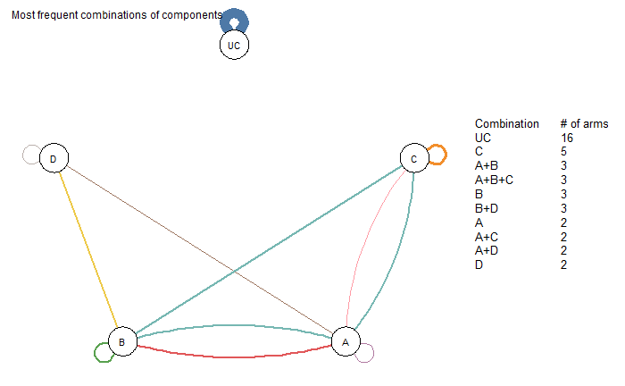
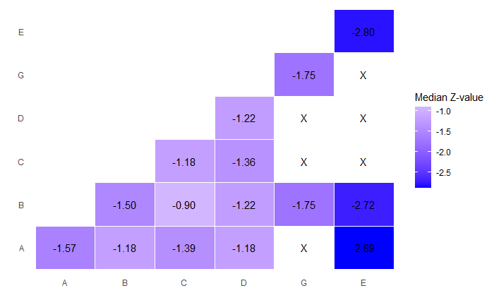
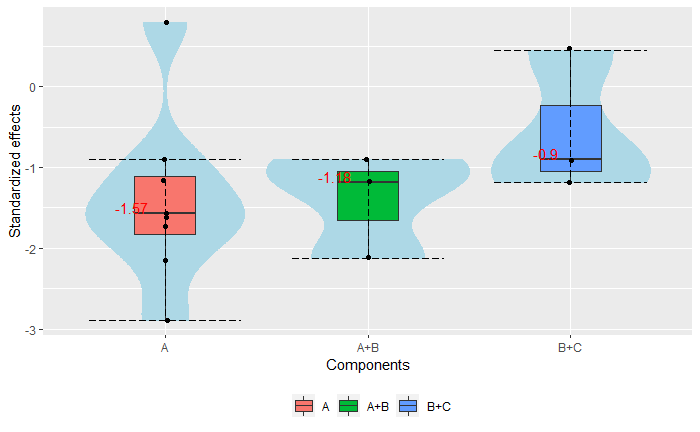
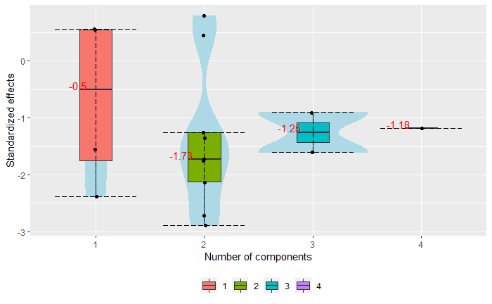
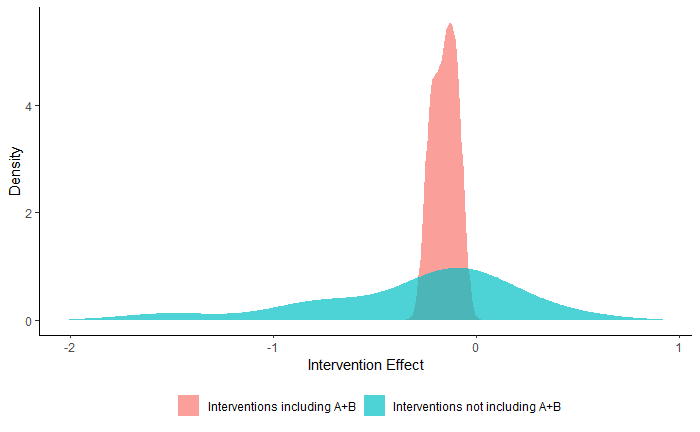
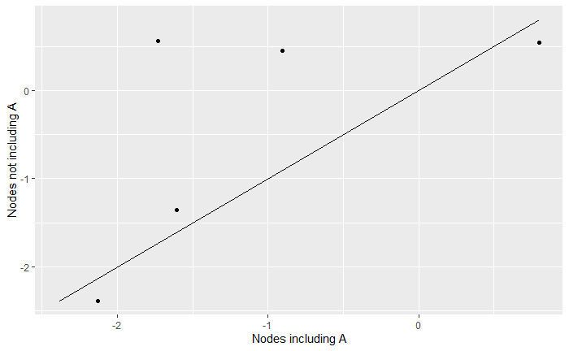
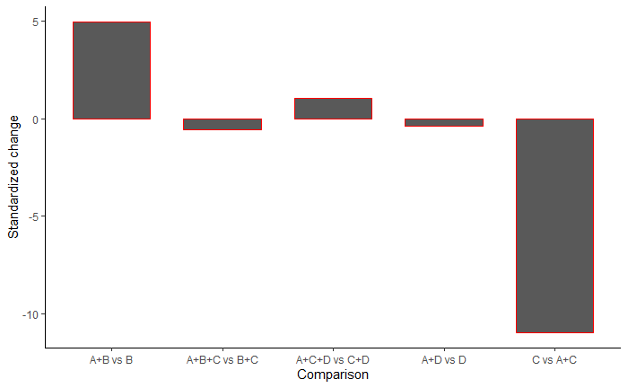
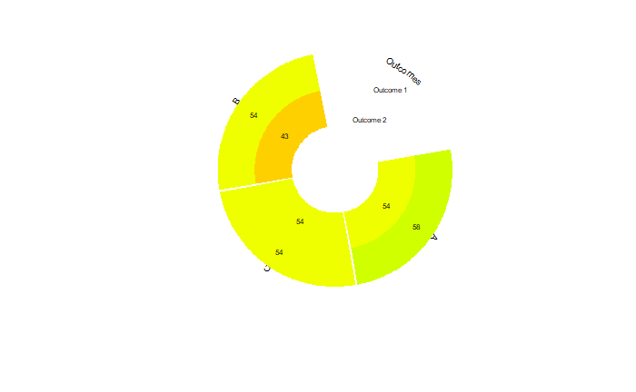
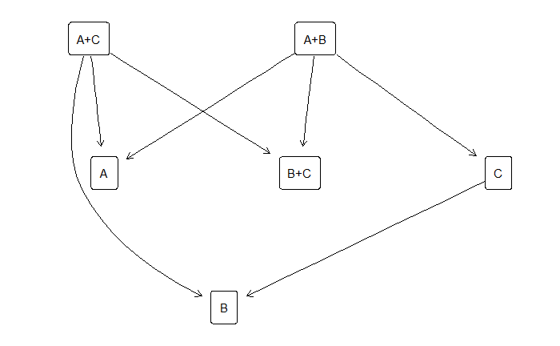

<!-- README.md is generated from README.Rmd. Please edit that file -->

```{r, include = FALSE}
knitr::opts_chunk$set(
  collapse = TRUE,
  comment = "#>",
  fig.path = "man/figures/README-",
  out.width = "100%"
)
```

# viscomp

<!-- badges: start -->
[](https://travis-ci.com/georgiosseitidis/viscomp)
<!-- badges: end -->

The goal of viscomp is to provide several visualization tools for exploring the behavior of the components in network meta-analysis: 

 * heat plot for the two-by-two component combinations 
 * leaving one component combination out scatter plot 
 * specific component combinations violin plots
 * components density plot 
 * waterfall plot for the interventions that differ by a specific component combination 
 * components network graph 
 * components rank heat plot for multiple outcomes 
 * hasse diagram. 

## Installation

You can install the development version of **viscomp** like so:

``` r
install.packages("devtools")
devtools::install_github("georgiosseitidis/viscomp")
```

## Usage

**Part 1: One single outcome**

Example of an artificial network meta-analysis compering the effectiveness of a number of (multicomponent) interventions for major adverse cardiovascular events (MACE). The network meta-analysis model uses the odds ratios obtained from the arm level data.

You can load the **viscomp** library

```{r, eval = FALSE}
library(viscomp)
```


Load the MACE dataset from **viscomp** package and conduct network meta-analysis.

```{r, eval = FALSE}
data(MACE, package = "viscomp")

library(netmeta)

data_NMA <- pairwise(studlab = Study, 
                      treat = list(treat1, treat2, treat3, treat4),
                      n = list(n1, n2, n3, n4), 
                      event = list(event1, event2, event3, event4), 
                      data = MACE, 
                      sm = "OR" )

net <- netmeta(TE = TE, 
               seTE = seTE, 
               studlab = studlab, 
               treat1 = treat1,
               treat2 = treat2, 
               data = data_NMA, 
               ref = "UC")

```

You can visualize the 10 most frequent components’ combinations found in the network with the **compGraph** function as follows:

```{r, eval = FALSE}
compGraph(net, mostF = 10)
```




You can visualize the median z-values for all the two-by-two component combinations with the **heatcomp** function as follows:

```{r, eval = FALSE}
heatcomp(net)
```



You can explore the effectiveness of specific components combinations (e.g. A, A + B, B + C) with the **specc** function as follows:

```{r, eval = FALSE}
specc(net, combination = c("A", "A + B", "B + C"))
```



You can explore if the number of components affects the effectiveness of the intervention with the function **specc** as follows:

```{r, eval = FALSE}
specc(net, components_number = TRUE)
```



You can create density plots for the component combination of interest (e.g combination A + B) with the function **denscomp** as follows:

```{r, eval = FALSE}
denscomp(net, combination = "A + B", z_value = FALSE)
```



You can explore if the inclusion-exclusion of a specific component (e.g. component A) or a component combination, affects the effectiveness of the intervention with the **loccos** function as follows:

```{r, eval = FALSE}
loccos(net, combination = "A", histogram = FALSE)
```



You can also explore if the inclusion-exclusion of a specific component (e.g. component A) or a component combination, affects the effectiveness of the intervention with the **watercomp** function as follows:

```{r, eval = FALSE}
watercomp(net, combination = "A")
```



**Part 2: Multiple outcomes**

Example of two artificial network meta-analysis models 

Construct the network meta-analysis models

```{r, eval = FALSE}
t1 <- c("A", "B", "C", "A+B", "A+C", "B+C", "A")
t2 <- c("C", "A", "A+C", "B+C", "A", "B", "B+C")

TE1 <- c(2.12, 3.24, 5.65, -0.60, 0.13, 0.66, 3.28)
TE2 <- c(4.69, 2.67, 2.73, -3.41, 1.79, 2.93, 2.51)

seTE1 <- rep(0.1, 7)
seTE2 <- rep(0.2, 7)

study <- paste0("study_", 1:7)

data1 <- data.frame("TE" = TE1, 
                    "seTE" = seTE1, 
                    "treat1" = t1, 
                    "treat2" = t2, 
                    "studlab" = study,
                    stringsAsFactors = FALSE)

data2 <- data.frame("TE" = TE2, 
                    "seTE" = seTE2, 
                    "treat1" = t1, 
                    "treat2" = t2, 
                    "studlab" = study,
                    stringsAsFactors = FALSE)

net1 <- netmeta(TE = TE, 
                seTE = seTE, 
                studlab = studlab, 
                treat1 = treat1,
                treat2 = treat2, 
                data = data1, 
                ref = "A")

net2 <- netmeta::netmeta(TE = TE, 
                         seTE = seTE, 
                         studlab = studlab, 
                         treat1 = treat1,
                         treat2 = treat2, 
                         data = data2, 
                         ref = "A")
```

You can visualize the p-scores of the components in both outcomes with the function **rankheatplot** as follows:
```{r, eval = FALSE}
rankheatplot(list(net1, net2))
```



You can create the hasse diagramm for the two functions using the **hassePlot** function as follows:
```{r, eval = FALSE}
hassePlot(ls = list(net1, net2))
```


